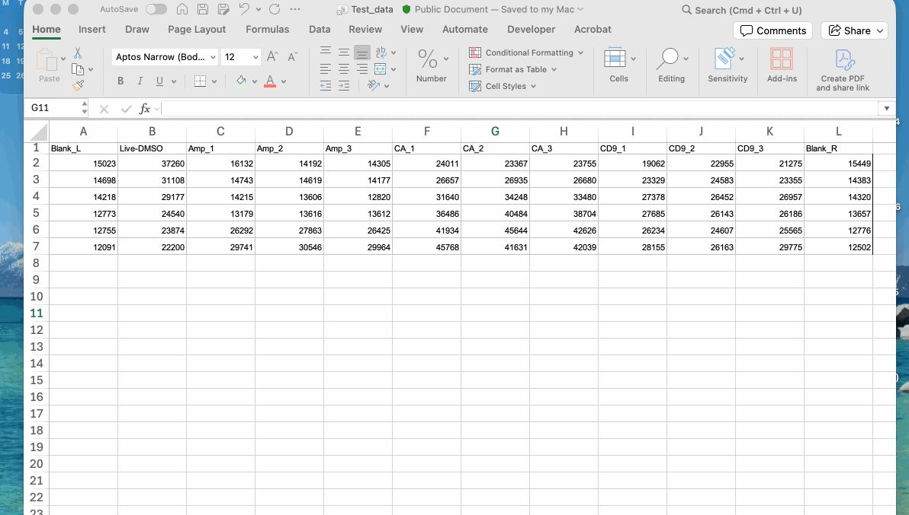

# Put the data into a useable format. 

Before we start, we can copy our raw plate results into an excel spreadsheet and add a column header to each one - whether the column is a Blank, Live/DMSO control, or which drug. 

For example: 

```{r}
#| echo: false
raw_data <- read.csv("Test_data.csv", header = TRUE)
knitr::kable(raw_data)
```

These headings are: 
  
- **Blanks:** Blank_L and Blank_R (so we can easily pick one or the other)
- **Live.DMSO:** The Live and DMSO controls 
- **Amp_1-3:** The three Amphotericin B columns 
- **CA1-3:** Caffeic acid 1-3 (example Drug 1)
- **CD91-3:** CD9 1-3 (example Drug 2)

Once you've got this, you want to save the table as CSV (Comma Separated Variables) - this is easier to read in R. 



::: {.callout-caution collapse="false"}

A CSV file can **only have one sheet** - if you have multiple sheets they will be deleted! 

I recommend using a separate CSV file for each plate and give each one a unique name e.g. Plate1_10Dec25_compoundX_compoundY.csv

:::
