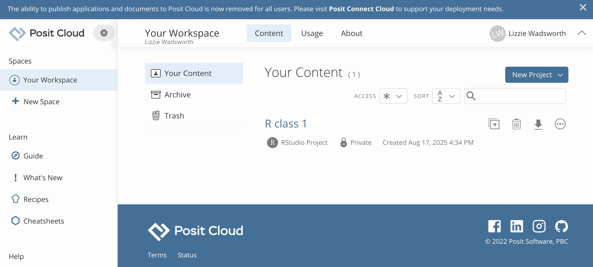

# Set up Posit Cloud workspace, upload the CSV file, and create an R file. 

Create a **free** account with [Posit Cloud](https://posit.cloud/plans/free) and sign in. 
_You will not need a paid account for this work_ 

Then:

1.  Click `"New Project"` -> `"New RStudio Project"` and wait for this to load

2.  Click the Upload button (under Files) and upload your CSV file. 

3.  Click the New File icon -> R Script

4.  Click the Save icon and give the file a name

You are now set up to start coding in R. 

