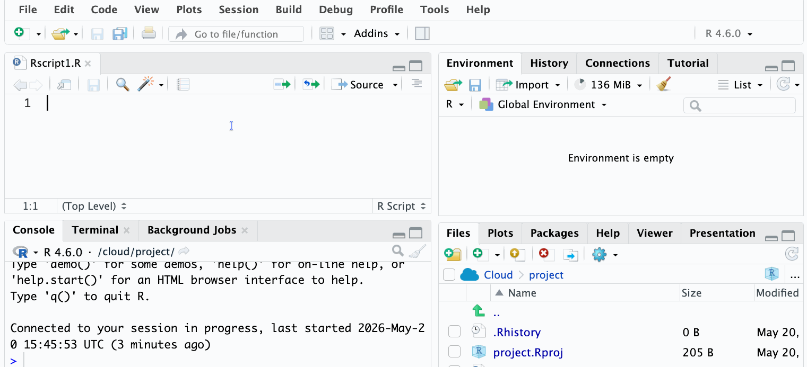

# Read the CSV file into R 

In R, the first line of code will be to read the CSV file. 

You will want to use `headers = TRUE` so that the first row is saved as the column headers. 

You will need to put in your filename where it says `"Test_data.csv"`

Any text after a `#` is a _comment_ - a note to ourselves to remind us what the code does. 

```{r}
#| eval: false
# Read the CSV file into R, and name it raw_data
raw_data <- read.csv("Test_data.csv", header = TRUE)
```

You can run the code by highlighting the line and clicking "Run"

`raw_data` should then appear in your Environment - you can click this to view the table. 

Check your column headings are what you expect them to be and that there aren't any extra (empty) table cells! 

