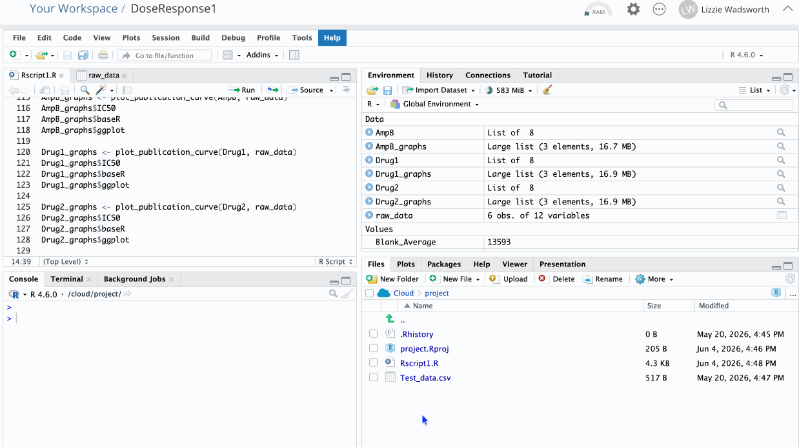

# Make your IC50 calculations and Dose Response graphs

## Install packages

First you'll need to install the packages needed: 
```{r}
#| eval: false
# Install packages
install.packages("ggplot2")
install.packages("drc")
```

## Copy and run the below code

Now all of the setup for your plate is done, the rest we can use **the same code for each one.**

See the screencast below the code for how to use: 

_In this example, the ggplot graph doesn't calculate correctly for AmpB, this is to do with the variability in the data as viability decreases for the first few dilutions_

```{r}
#| eval: false
# Import libraries
library(ggplot2)
library(drc)

# Define functions
calculate_dilutions <- function(highest_conc, dilution_factor, dilutions=5){
  result_vector <- highest_conc / (dilution_factor^(0:dilutions))  
  return(result_vector)
}

plot_publication_curve <- function(drug, raw_data_matrix) {
  
  # Extract data points for the chosen drug, using col_start and col_stop to select columns (all rows)
  drug_raw_data <- raw_data_matrix[, drug$col_start:drug$col_stop]
  
  # Calculate drug concentrations for each row using start concentration and dilution factor
  concs <- calculate_dilutions(drug$start_conc, drug$dilution_factor, dilutions = 5)
  
  # Make a big table with each concentration repeated for each raw value
  drug_data <- data.frame(
    conc = rep(concs, times = ncol(drug_raw_data)),
    raw_val = unlist(drug_raw_data)
  )
  
  # Minus blank, and divide by positive control, to get % viability
  drug_data$viability <- ((drug_data$raw_val - drug$blank) / drug$positive_control) * 100
  
  # Use drm from drc package to fit a dose-response curve to the data
  max_viability <- max(drug_data$viability)
  drug_model <- drm(viability ~ conc, data = drug_data, fct = LL.4(fixed = c(NA, 0, max_viability, NA)))  
  
  # print the results 
  print(summary(drug_model))
  
  # calculate and print the IC50 value
  ic50_info <- ED(drug_model, 50, type = "absolute", display = FALSE)
  cat("IC50 value: ", ic50_info[1], " with standard error ", ic50_info[2], "\n")
  
  # plot this dose-response model using Base R 
  plot(drug_model, broken = TRUE, type = "all", xlab = paste0(drug$name, " (",drug$unit,")"), ylab = "Percent viability")
  dose_curve_baseR <- recordPlot()
  
  # Use the model to create a set of predicted values, to use as a curve in a ggplot 
  prediction_data <- expand.grid(conc=seq(from=min(concs), to=max(concs), length = 100))
  pm <- predict(drug_model, newdata=prediction_data, interval="confidence")

  prediction_data$p <- pm[,1]
  prediction_data$pmin <- pm[,2]
  prediction_data$pmax <- pm[,3]
  
  xlabel <- paste0(drug$name, " (",drug$unit,")")
  
  # plot this with ggplot
  dose_curve_ggplot <- ggplot(drug_data, aes(x = conc, y = viability)) + 
    # plot the raw values, add scatter points
    geom_point() + 
    # add a ribbon using the predicted values
    geom_ribbon(data=prediction_data, aes(x=conc, y=p, ymin=pmin, ymax=pmax), alpha = 0.2) + 
    geom_line(data=prediction_data, aes(x=conc, y=p)) +
    # make the x axis a log scale
    scale_x_log10() + 
    # x and y axis labels
    xlab(xlabel) + ylab("Percent viability (cm)") + 
    theme_minimal()
    
    
  # return the values 
  return(list(IC50 = ic50_info, baseR = dose_curve_baseR, ggplot = dose_curve_ggplot)) 
}

# Run the functions for each graph
AmpB_graphs <- plot_publication_curve(AmpB, raw_data)
AmpB_graphs$IC50
AmpB_graphs$baseR
AmpB_graphs$ggplot

Drug1_graphs <- plot_publication_curve(Drug1, raw_data)
Drug1_graphs$IC50 
Drug1_graphs$baseR
Drug1_graphs$ggplot

Drug2_graphs <- plot_publication_curve(Drug2, raw_data)
Drug2_graphs$IC50
Drug2_graphs$baseR
Drug2_graphs$ggplot
```

## Get the result

Each of the lines at the bottom will give you a different result: 
  
- AmpB_graphs$IC50: The IC50 value and standard error for Amphotericin B 
- AmpB_graphs$baseR: A simple dose-response curve 
- AmpB_graphs$ggplot: A fancier dose-response curve (which doesn't work for AmpB in this example)

Once you've run the whole code, you can select and run one of these lines at a time. 

The IC50 values will appear in the console, and the plots will appear in the bottom right panel. You can export the plots as PNG files. 




